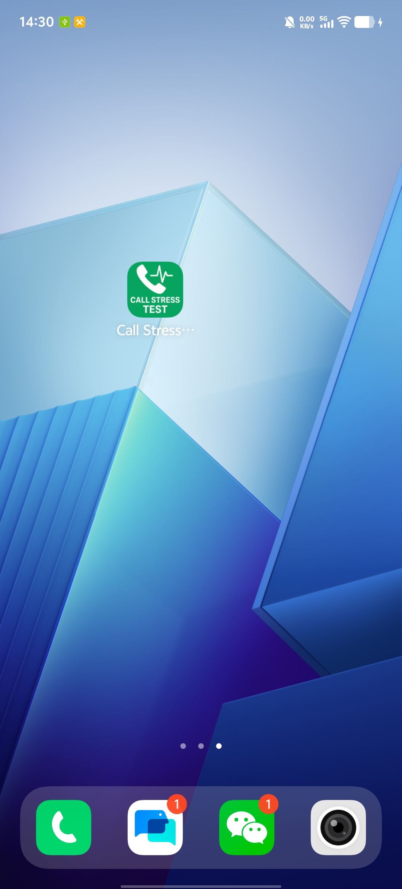

# Call Stress Test

<div align="center">


An Android application designed for automated phone call stress testing. This tool helps developers and QA engineers test phone call functionality, network stability, and device performance under repeated calling scenarios.

</div>

---

## 📋 Table of Contents

- [Features](#-features)
- [Screenshots](#-screenshots)
- [Requirements](#-requirements)
- [Installation](#-installation)
- [Usage Guide](#-usage-guide)
- [Permissions](#-permissions)
- [Technical Details](#-technical-details)
- [Building from Source](#-building-from-source)
- [Safety Features](#-safety-features)
- [Troubleshooting](#-troubleshooting)
- [Contributing](#-contributing)
- [License](#-license)
- [Disclaimer](#-disclaimer)

---

## ✨ Features

- **Automated Call Testing**: Automatically place multiple phone calls with configurable intervals
- **Real-time Monitoring**: Track call states (idle, ringing, connected) in real-time
- **Detailed Statistics**: View success/failure rates, call duration, and progress
- **Comprehensive Logging**: Timestamped logs for every call attempt and state change
- **Safety Mechanisms**:
  - Minimum 5-second interval between calls
  - 30-second timeout for unresponsive calls
  - Confirmation dialogs for large test batches
- **User-friendly Interface**: Clean, intuitive Material Design UI
- **Progress Tracking**: Visual progress bar and detailed statistics
- **Flexible Configuration**: Customize phone number, call count, and interval timing

---

## 📱 Screenshots

<div align="center">

### Application Interface


### Application


</div>

---

## 📋 Requirements

- **Android Device**: Physical Android device (Android 7.0 / API 24 or higher)
- **SIM Card**: Active SIM card with calling capability
- **Permissions**: Phone call, phone state, and call log permissions
- **Network**: Active cellular network connection

**Note**: This app requires a physical Android device with telephony capabilities. It will not work on emulators without proper telephony support.

---

## 📥 Installation

### Method 1: Install Pre-built APK

1. **Download APK**: [📥 Download base.apk](base.apk) or get the latest version from the [Releases](../../releases) page
2. Enable "Install from Unknown Sources" in your Android settings:
   - Go to **Settings** → **Security** → **Install unknown apps**
   - Select your browser or file manager
   - Enable "Allow from this source"
3. Open the downloaded APK file and tap **Install**
4. Grant the required permissions when prompted

### Method 2: Build from Source

See [Building from Source](#-building-from-source) section below.

---

## 📖 Usage Guide

### Step 1: Launch the Application

Open the **Call Stress Test** app from your app drawer.

### Step 2: Grant Permissions

On first launch, the app will request the following permissions:
- **Phone**: Make and manage phone calls
- **Phone State**: Read phone state and identity
- **Call Log**: Read call log

Tap **Allow** for all permissions. These are essential for the app to function.

### Step 3: Configure Test Parameters

Fill in the following fields:

#### 📱 Phone Number
- Enter the phone number you want to test
- Supports formats: `13800138000`, `+8613800138000`, `86 138 0013 8000`
- The app automatically formats Chinese mobile numbers with +86 prefix

#### 🔢 Call Count
- Enter the number of calls to make
- Minimum: 1 call
- Maximum: Unlimited (warning shown for >1000 calls)
- Example: `10` for 10 test calls

#### ⏱️ Call Interval (milliseconds)
- Time to wait between calls
- Minimum: 5000ms (5 seconds)
- Recommended: 10000ms (10 seconds) or higher
- Example: `10000` for 10-second intervals

### Step 4: Start the Test

1. Review your configuration
2. Tap the **Start Test** button
3. Review the confirmation dialog showing:
   - Test phone number
   - Total call count
   - Interval time
   - Estimated duration
4. Tap **Start** to begin the test

### Step 5: Monitor Progress

During the test, you can monitor:

- **Progress Bar**: Visual representation of test completion
- **Statistics Card**:
  - Total Calls: Total number of calls configured
  - Successful: Calls that connected successfully
  - Failed: Calls that failed or timed out
- **Current Status**: Real-time status of the current operation
- **Log Window**: Detailed timestamped log of all events

### Step 6: Stop or Complete Test

- **Manual Stop**: Tap the **Stop Test** button to halt the test early
- **Automatic Completion**: The test completes automatically after all calls
- **Results Dialog**: View final statistics including success rate

### Step 7: Review Results

After completion, review:
- Total calls made
- Successful connections
- Failed attempts
- Overall success rate percentage

---

## 🔐 Permissions

This app requires the following Android permissions:

| Permission | Purpose | Required |
|------------|---------|----------|
| `CALL_PHONE` | Make phone calls automatically | ✅ Yes |
| `READ_PHONE_STATE` | Monitor call state changes | ✅ Yes |
| `READ_CALL_LOG` | Access call history for verification | ✅ Yes |
| `ANSWER_PHONE_CALLS` | Handle incoming calls during test | ⚠️ Optional |

**Privacy Note**: This app does NOT:
- Send data to external servers
- Store call logs permanently
- Share your information with third parties
- Make calls without your explicit consent

---

## 🔧 Technical Details

### Architecture

- **Language**: Kotlin
- **UI Framework**: Android Views with Material Design
- **Minimum SDK**: 24 (Android 7.0 Nougat)
- **Target SDK**: 36 (Android 14+)
- **Architecture Pattern**: Single Activity with lifecycle-aware components

### Key Components

#### MainActivity.kt
The main activity handles:
- UI initialization and event handling
- Permission management
- Call state monitoring via `TelephonyCallback`
- Test execution and scheduling
- Statistics tracking and logging

#### Call State Management
- Uses `TelephonyManager` and `TelephonyCallback` (Android 12+)
- Monitors three states: IDLE, RINGING, OFFHOOK
- Implements timeout detection (30 seconds)
- Handles edge cases (no answer, busy, network errors)

#### Threading Model
- Main thread: UI updates and user interactions
- Handler: Scheduled tasks and delayed operations
- ExecutorService: Background task management

### Call Flow

```
Start Test
    ↓
Make Call (ACTION_CALL Intent)
    ↓
Monitor State: IDLE → RINGING → OFFHOOK
    ↓
Call Connected → Log Success
    ↓
Wait Interval
    ↓
Next Call (or Complete if done)
```

### Safety Features

1. **Minimum Interval**: 5-second minimum between calls
2. **Timeout Protection**: 30-second timeout for unresponsive calls
3. **Confirmation Dialogs**: Warnings for large test batches (>1000 calls)
4. **Permission Checks**: Runtime permission verification
5. **State Validation**: Prevents overlapping calls

---

## 🛠️ Building from Source

### Prerequisites

- **Android Studio**: Arctic Fox (2020.3.1) or newer
- **JDK**: Java 11 or higher
- **Android SDK**: API 24-36
- **Gradle**: 7.0+ (included in project)

### Build Steps

1. **Clone the Repository**
   ```bash
   git clone https://github.com/yourusername/CallStressTest.git
   cd CallStressTest
   ```

2. **Open in Android Studio**
   - Launch Android Studio
   - Select **File** → **Open**
   - Navigate to the cloned directory
   - Click **OK**

3. **Sync Gradle**
   - Android Studio will automatically sync Gradle
   - Wait for dependencies to download
   - Resolve any SDK version issues if prompted

4. **Connect Device**
   - Enable **Developer Options** on your Android device:
     - Go to **Settings** → **About Phone**
     - Tap **Build Number** 7 times
   - Enable **USB Debugging**:
     - Go to **Settings** → **Developer Options**
     - Enable **USB Debugging**
   - Connect device via USB
   - Accept the debugging authorization prompt

5. **Build and Run**
   - Click the **Run** button (green triangle) in Android Studio
   - Or use command line:
     ```bash
     ./gradlew assembleDebug
     ```
   - APK will be generated in: `app/build/outputs/apk/debug/`

6. **Install APK**
   ```bash
   adb install app/build/outputs/apk/debug/app-debug.apk
   ```

### Build Variants

- **Debug**: Development build with debugging enabled
  ```bash
  ./gradlew assembleDebug
  ```

- **Release**: Production build (requires signing)
  ```bash
  ./gradlew assembleRelease
  ```

---

## 🛡️ Safety Features

### Built-in Protections

1. **Rate Limiting**
   - Minimum 5-second interval enforced
   - Prevents device overload
   - Protects against accidental spam

2. **Timeout Detection**
   - 30-second timeout for each call
   - Automatic failure marking
   - Prevents infinite waiting

3. **User Confirmations**
   - Confirmation dialog before starting
   - Warning for large test batches (>1000)
   - Stop confirmation to prevent accidents

4. **State Management**
   - Prevents overlapping calls
   - Proper cleanup on app destruction
   - Handler callback management

5. **Error Handling**
   - Try-catch blocks for all critical operations
   - Graceful failure recovery
   - Detailed error logging

---

## 🐛 Troubleshooting

### Common Issues

#### 1. App Crashes on Launch
**Solution**:
- Ensure you're running on a physical device (not emulator)
- Check that all permissions are granted
- Verify Android version is 7.0 or higher

#### 2. Calls Not Being Made
**Possible Causes**:
- Missing `CALL_PHONE` permission
- No active SIM card
- Airplane mode enabled
- Invalid phone number format

**Solution**:
- Grant all required permissions
- Check SIM card status
- Disable airplane mode
- Verify phone number format

#### 3. All Calls Marked as Failed
**Possible Causes**:
- Network connectivity issues
- Invalid phone number
- Call blocking enabled
- Insufficient balance

**Solution**:
- Check cellular network signal
- Verify phone number is correct
- Disable call blocking features
- Ensure sufficient account balance

#### 4. App Stops Responding
**Solution**:
- Force stop the app
- Clear app cache: **Settings** → **Apps** → **Call Stress Test** → **Storage** → **Clear Cache**
- Restart device
- Reinstall the app

#### 5. Permission Denied Errors
**Solution**:
- Go to **Settings** → **Apps** → **Call Stress Test** → **Permissions**
- Enable all required permissions
- Restart the app

### Debug Mode

To enable detailed logging:
1. Connect device via USB
2. Open Android Studio
3. View **Logcat** window
4. Filter by package: `com.example.callstresstest`

---

## 🤝 Contributing

Contributions are welcome! Here's how you can help:

### Reporting Bugs

1. Check if the issue already exists in [Issues](../../issues)
2. Create a new issue with:
   - Clear description of the problem
   - Steps to reproduce
   - Expected vs actual behavior
   - Device model and Android version
   - Screenshots or logs if applicable

### Suggesting Features

1. Open a new issue with the `enhancement` label
2. Describe the feature and its use case
3. Explain why it would be valuable

### Submitting Pull Requests

1. Fork the repository
2. Create a feature branch: `git checkout -b feature/your-feature-name`
3. Make your changes
4. Test thoroughly on physical device
5. Commit with clear messages: `git commit -m "Add: feature description"`
6. Push to your fork: `git push origin feature/your-feature-name`
7. Open a Pull Request with detailed description

### Code Style

- Follow Kotlin coding conventions
- Use meaningful variable and function names
- Add comments for complex logic
- Keep functions focused and concise
- Test on multiple Android versions

---

## 📄 License

This project is licensed under the MIT License - see the [LICENSE](LICENSE) file for details.

```
MIT License

Copyright (c) 2024 CallStressTest

Permission is hereby granted, free of charge, to any person obtaining a copy
of this software and associated documentation files (the "Software"), to deal
in the Software without restriction, including without limitation the rights
to use, copy, modify, merge, publish, distribute, sublicense, and/or sell
copies of the Software, and to permit persons to whom the Software is
furnished to do so, subject to the following conditions:

The above copyright notice and this permission notice shall be included in all
copies or substantial portions of the Software.

THE SOFTWARE IS PROVIDED "AS IS", WITHOUT WARRANTY OF ANY KIND, EXPRESS OR
IMPLIED, INCLUDING BUT NOT LIMITED TO THE WARRANTIES OF MERCHANTABILITY,
FITNESS FOR A PARTICULAR PURPOSE AND NONINFRINGEMENT. IN NO EVENT SHALL THE
AUTHORS OR COPYRIGHT HOLDERS BE LIABLE FOR ANY CLAIM, DAMAGES OR OTHER
LIABILITY, WHETHER IN AN ACTION OF CONTRACT, TORT OR OTHERWISE, ARISING FROM,
OUT OF OR IN CONNECTION WITH THE SOFTWARE OR THE USE OR OTHER DEALINGS IN THE
SOFTWARE.
```

---

## ⚠️ Disclaimer

**IMPORTANT: Please read carefully before using this application.**

### Intended Use

This application is designed for:
- **Testing and Development**: QA testing of telephony features
- **Network Testing**: Evaluating call quality and network stability
- **Educational Purposes**: Learning about Android telephony APIs
- **Authorized Testing**: Testing with your own phone numbers or with explicit permission

### Prohibited Use

This application must NOT be used for:
- ❌ Harassment or spam calling
- ❌ Unauthorized testing of third-party numbers
- ❌ Any illegal activities
- ❌ Violating telecommunications regulations
- ❌ Disrupting services or networks

### Legal Responsibility

- **User Responsibility**: You are solely responsible for how you use this application
- **Compliance**: Ensure compliance with local telecommunications laws and regulations
- **Consent**: Only test with phone numbers you own or have explicit permission to call
- **Liability**: The developers are not liable for any misuse of this application

### Ethical Guidelines

1. **Obtain Permission**: Always get consent before testing with any phone number
2. **Respect Privacy**: Do not use this tool to invade anyone's privacy
3. **Follow Laws**: Comply with all applicable laws and regulations
4. **Be Responsible**: Use reasonable test parameters to avoid network abuse
5. **Report Issues**: Report any bugs or security concerns responsibly

### Carrier Considerations

- Excessive calling may trigger carrier fraud detection systems
- Your account may be temporarily suspended for unusual activity
- Additional charges may apply for calls made during testing
- Some carriers may block or throttle automated calling

**By using this application, you acknowledge that you have read, understood, and agree to comply with this disclaimer and all applicable laws.**

---

## 📞 Support

- **Issues**: [GitHub Issues](../../issues)
- **Discussions**: [GitHub Discussions](../../discussions)
- **Email**: your.email@example.com

---

## 🙏 Acknowledgments

- Android Open Source Project for telephony APIs
- Material Design for UI components
- Kotlin community for language support

---

<div align="center">

**Made with ❤️ for Android Developers**

⭐ Star this repo if you find it useful!

</div>
